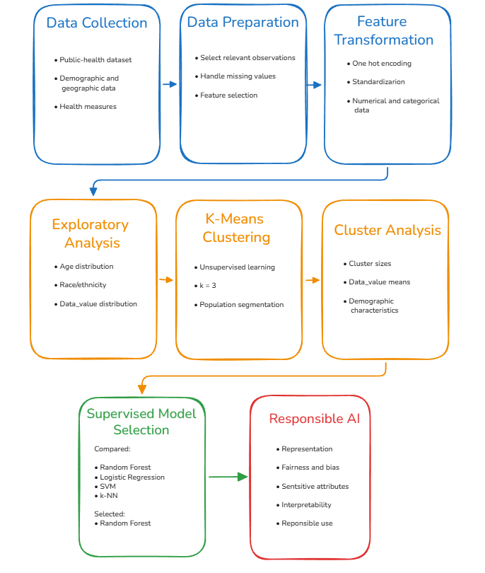
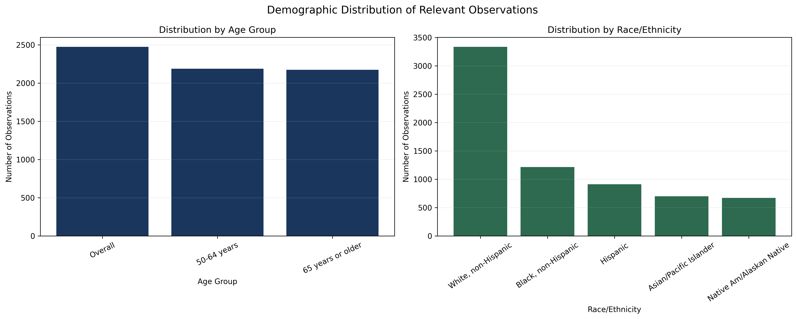
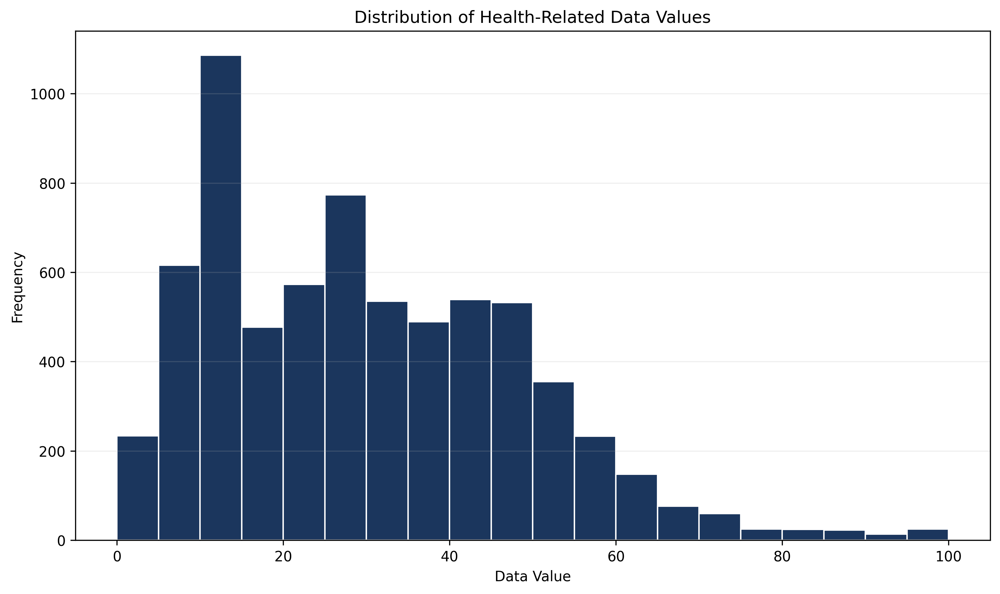
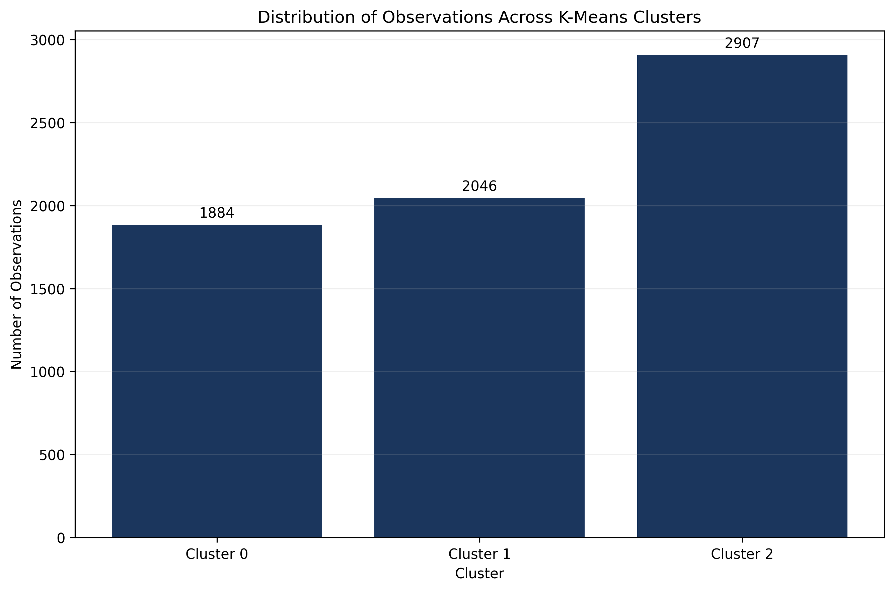
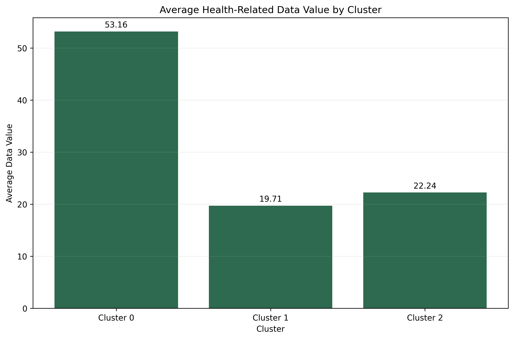

# Demographic Clustering & Responsible AI

## Overview

This project explores the application of machine learning to demographic and public-health data in the context of Alzheimer's disease analysis.

The project covers the machine learning lifecycle from data preparation and exploratory analysis through unsupervised clustering, supervised model selection, scalability considerations, and responsible AI analysis. Particular attention was given to understanding how demographic attributes can influence machine learning systems and how sensitive variables should be considered when developing healthcare-oriented models.

This portfolio version focuses on the methodology, machine learning concepts, exploratory analysis, clustering results, model-selection process, and responsible AI considerations developed throughout the project.

---

## Objectives

The primary objectives of the project were to:

- Prepare structured demographic and public-health data for machine learning.
- Identify and handle missing or inconsistent data.
- Transform categorical variables into machine-readable representations.
- Standardize numerical features for machine learning analysis.
- Examine demographic representation through exploratory data analysis.
- Explore population patterns using unsupervised clustering.
- Analyze the characteristics of the resulting clusters.
- Evaluate potential supervised learning approaches.
- Select an appropriate classification approach based on the characteristics of the problem.
- Consider strategies for model optimization and scalability.
- Examine fairness and bias associated with sensitive demographic attributes.
- Consider model transparency, interpretability, and responsible use.

---

## Approach

### Data Preparation

The project worked with structured public-health data containing demographic, geographic, temporal, and health-related information.

The dataset was examined for structural inconsistencies, missing values, and features that were not relevant to the analytical objective. Relevant demographic and numerical attributes were then selected for subsequent analysis.

Missing or unusable observations were handled before the data was transformed for machine learning.

### Feature Transformation

The selected features included both categorical and numerical variables.

Categorical attributes such as geographic location, age group, and race/ethnicity were transformed into machine-readable representations using **one-hot encoding**.

Numerical attributes were standardized so that differences in scale would not disproportionately influence the distance calculations used by K-Means.

These preprocessing steps created a consistent feature representation suitable for distance-based machine learning techniques and exploratory population analysis.

### Demographic Clustering

K-Means clustering was applied as an exploratory unsupervised learning technique to investigate patterns within the prepared feature space.

Rather than using clustering as the final prediction method, the objective was to identify groups of observations with similar demographic, geographic, temporal, and numerical characteristics.

The resulting cluster assignments provided an additional analytical perspective for understanding patterns within the dataset.

---

## Machine Learning Workflow

The overall machine learning process followed the workflow shown below:

The workflow covers the major stages of:

**Data Collection → Data Preparation → Feature Transformation → Exploratory Analysis → K-Means Clustering → Cluster Analysis → Supervised Model Selection → Responsible AI**

The workflow separates the exploratory clustering implementation from the supervised model-selection analysis. K-Means was used to investigate patterns within the dataset, while several supervised algorithms were compared conceptually to determine an appropriate approach for a potential classification system.

---

## Exploratory Data Analysis

Exploratory data analysis was performed to better understand the demographic composition and numerical characteristics of the dataset before interpreting the clustering results.

Understanding these distributions was particularly important because demographic representation and numerical variability can influence the patterns identified by machine learning algorithms.

### Demographic Distributions

Key demographic variables were examined to understand how different population groups were represented in the filtered dataset.

The two specific age categories, **50–64 years** and **65 years or older**, appeared at relatively similar frequencies, while the broader `Overall` category contained somewhat more observations.

A more pronounced difference appeared across race and ethnicity categories. White, non-Hispanic observations represented the largest portion of the filtered dataset, while the remaining demographic groups appeared considerably less frequently.

This imbalance is important when interpreting subsequent machine learning results because unequal representation can influence the patterns identified by a clustering or predictive algorithm.

It also reinforces the importance of examining demographic representation when evaluating healthcare-oriented machine learning systems.

### Numerical Feature Distribution

The distribution of the primary numerical health-related variable was examined to understand its range, concentration, and variability.

`Data_Value` spans a broad numerical range, with most observations concentrated in the lower and middle portions of the distribution.

A particularly high concentration appears within the lower-value range, while observations become progressively less frequent toward the upper end.

The distribution therefore exhibits a noticeable right tail, indicating that high numerical values occur less frequently than low-to-moderate values.

Understanding this distribution is important because `Data_Value` contributes directly to the feature space used by the clustering algorithm and therefore influences how observations may be grouped.

---

## Clustering Analysis

K-Means clustering was used to identify groups of observations with similar characteristics within the transformed multidimensional feature space.

The clustering model incorporated information related to:

- Year
- Geographic location
- Age group
- Race/ethnicity
- Numerical health-related measurements

The clustering stage was intended as an **exploratory technique rather than a diagnostic or predictive model**.

For this analysis, the dataset was segmented into three clusters.

### Cluster Distribution

The number of observations assigned to each cluster was examined to understand how the clustering algorithm segmented the dataset.

K-Means divided the prepared observations into three groups of different sizes:

- **Cluster 0:** 1,884 observations
- **Cluster 1:** 2,046 observations
- **Cluster 2:** 2,907 observations

Cluster 2 represented the largest group, while Cluster 0 contained the fewest observations.

The unequal cluster sizes are expected because K-Means does not attempt to create equally sized groups. Instead, it assigns observations according to their similarity within the transformed feature space while attempting to minimize within-cluster variation.

### Cluster Characteristics

The clusters were also examined to determine whether their numerical characteristics differed.

The clusters exhibited noticeable differences in their average `Data_Value`:

- **Cluster 0:** approximately 53.16
- **Cluster 1:** approximately 19.71
- **Cluster 2:** approximately 22.24

Cluster 0 demonstrated a substantially higher average numerical value than the other two groups.

Clusters 1 and 2 had more similar average values, indicating that their separation was likely influenced by additional dimensions within the feature space rather than `Data_Value` alone.

This distinction is important when interpreting the clustering results. Membership was determined using a combination of demographic, geographic, temporal, and numerical features.

The clusters therefore should **not** be interpreted solely according to their average `Data_Value`, nor should they be treated as direct Alzheimer's disease-risk categories.

Instead, they represent groups of observations that share similarities across the combination of features supplied to the clustering algorithm.

---

## Supervised Model Selection

The project also evaluated several supervised machine learning approaches for a potential risk-classification system.

The algorithms considered included:

- Random Forest
- Logistic Regression
- Support Vector Machine (SVM)
- k-Nearest Neighbors (k-NN)

### Random Forest

Random Forest was selected as the proposed supervised learning approach because of its ability to capture complex relationships within structured data while providing feature-importance information that can support interpretation.

Its ensemble structure combines multiple decision trees, reducing reliance on the behavior of a single tree and making it suitable for datasets containing interacting features.

### Logistic Regression

Logistic Regression offers greater simplicity and interpretability and could provide a useful baseline classification model.

However, it models relationships using a linear decision boundary unless additional transformations or feature engineering are introduced, which may limit its ability to represent more complex interactions.

### Support Vector Machine

Support Vector Machines can model nonlinear relationships through kernel functions and can perform effectively in high-dimensional feature spaces.

However, they may require greater computational resources as dataset size increases and generally provide less direct interpretability than tree-based approaches.

### k-Nearest Neighbors

k-Nearest Neighbors provides an intuitive similarity-based classification approach.

However, prediction requires comparing new observations against stored training data, which can increase computational cost as the dataset grows.

Its performance is also particularly sensitive to feature scaling, distance representation, and the selected value of `k`.

### Selected Approach

Random Forest was identified as the most appropriate proposed supervised approach based on its combination of:

- Ability to model nonlinear relationships
- Compatibility with structured data
- Ensemble-based prediction
- Feature-importance capabilities
- Practical scalability
- Balance between predictive capability and interpretability

The model-selection process emphasized that choosing a machine learning algorithm requires considering more than predictive performance alone.

---

## Model Optimization & Scalability

The project examined strategies that could be applied to improve the performance, reliability, and computational efficiency of a supervised model.

These included:

- Training, validation, and testing separation
- Cross-validation
- Hyperparameter tuning
- Randomized parameter search
- Feature selection
- Model-complexity control
- Larger and more representative datasets

For a Random Forest implementation, parameters such as tree depth, number of trees, and minimum sample requirements could be tuned to balance predictive performance and computational complexity.

Randomized parameter search could provide a more computationally efficient alternative to evaluating every possible hyperparameter combination.

Feature selection could also reduce unnecessary dimensionality and improve both computational efficiency and interpretability.

With additional data and computational resources, more extensive model searches, ensemble approaches, and advanced interpretability techniques could be explored.

This analysis emphasized that model optimization requires balancing:

**Predictive Performance → Generalization → Interpretability → Computational Cost**

---

## Model Evaluation

For the proposed supervised classification approach, multiple evaluation metrics were considered to provide a more complete understanding of model behavior.

### Accuracy

Accuracy measures the proportion of predictions correctly classified by the model.

While useful as an overall performance measure, accuracy alone may provide an incomplete picture when class distributions are uneven.

### Precision

Precision measures the proportion of positive predictions made by the model that are actually positive.

This metric can help evaluate the reliability of positive classifications.

### Recall

Recall measures the model's ability to identify observations belonging to the positive class.

In healthcare-oriented applications, recall may be particularly important when failing to identify relevant cases carries meaningful consequences.

### ROC-AUC

ROC-AUC measures how effectively a classifier distinguishes between classes across different classification thresholds.

Using multiple evaluation metrics would provide a more complete view of model behavior than relying on a single score.

In a healthcare-oriented application, aggregate performance metrics alone would also be insufficient. Performance should be examined across demographic subgroups to identify potential disparities in model behavior.

---

## Responsible AI Analysis

A major component of the project involved examining the ethical implications of applying machine learning to healthcare-related demographic data.

The exploratory analysis itself demonstrates why these considerations are important: the represented racial and ethnic groups do not occur at equal frequencies within the filtered dataset.

### Representation

Population representation was examined before interpreting the machine learning results.

The demographic analysis showed substantially greater representation for White, non-Hispanic observations compared with the other represented racial and ethnic groups.

This does not by itself demonstrate algorithmic bias.

However, it identifies an important characteristic of the dataset that should be considered when evaluating downstream model behavior.

### Demographic Bias

Sensitive demographic attributes can contribute to or reinforce existing disparities when population groups are represented inconsistently within the underlying data.

Differences in representation, missing information, data-collection practices, or historical healthcare patterns may influence the relationships learned by a machine learning system.

For this reason, demographic distributions should be documented and evaluated rather than treated as neutral characteristics of the dataset.

### Sensitive Attributes

Variables such as race and sex require careful interpretation when incorporated into healthcare-oriented machine learning systems.

Race, in particular, should not automatically be interpreted as a biological risk factor.

Observed relationships may reflect social, environmental, economic, healthcare-access, and structural differences rather than biological differences.

Sensitive attributes can nevertheless provide value when auditing model behavior and determining whether performance differs between population groups.

### Fairness

The project considered several strategies for identifying and mitigating potential fairness issues, including:

- Examining demographic representation within the dataset.
- Evaluating performance across demographic subgroups.
- Considering reweighting or resampling when groups are underrepresented.
- Standardizing demographic categories.
- Carefully handling missing demographic information.
- Considering fairness-aware model adjustments when disparities are identified.

Evaluating subgroup performance is particularly important because strong aggregate model performance can potentially conceal weaker performance for individual population groups.

### Transparency & Interpretability

Healthcare-oriented machine learning systems require transparency regarding how predictions are generated and which variables influence model behavior.

For tree-based models such as Random Forest, feature-importance analysis can provide an initial indication of which variables contribute most strongly to predictions.

Additional interpretability approaches could further help identify potentially problematic dependencies on sensitive attributes and provide stakeholders with context for understanding model outputs.

### Responsible Use

A predictive healthcare model should be treated as a **decision-support system rather than a standalone diagnostic system**.

Machine learning outputs should not replace clinical judgment or be interpreted as direct medical diagnoses without appropriate validation.

Model limitations, potential sources of bias, uncertainty, and appropriate usage boundaries should be clearly communicated to reduce the risk of overreliance or inappropriate interpretation.

---

## Technologies

### Languages & Libraries

- Python
- Pandas
- NumPy
- Scikit-learn
- Matplotlib

### Machine Learning

- Unsupervised Learning
- K-Means Clustering
- Data Preprocessing
- One-Hot Encoding
- Feature Scaling
- Standardization
- Exploratory Data Analysis
- Population Segmentation
- Supervised Model Selection
- Classification
- Model Evaluation

### Responsible AI

- Demographic Representation Analysis
- Fairness & Bias Analysis
- Sensitive Attribute Considerations
- Subgroup Evaluation
- Model Transparency
- Interpretability
- Responsible Healthcare AI

---

## Key Takeaways

This project strengthened my understanding of how demographic and healthcare-oriented machine learning problems require consideration of both technical methodology and responsible model development.

Key areas of development included:

- Preparing structured demographic data for machine learning.
- Working with categorical and numerical features.
- Applying one-hot encoding and standardization.
- Understanding why feature transformation is particularly important for distance-based algorithms.
- Performing exploratory analysis before machine learning.
- Using K-Means clustering to explore multidimensional population structure.
- Interpreting cluster sizes and characteristics.
- Understanding that clusters represent multidimensional similarity rather than predefined real-world categories.
- Avoiding unsupported interpretations of unsupervised learning results.
- Comparing supervised learning algorithms based on technical and practical considerations.
- Considering scalability and model-optimization strategies.
- Recognizing potential issues associated with unequal demographic representation.
- Understanding the importance of subgroup-level model evaluation.
- Considering transparency and interpretability in healthcare AI.
- Distinguishing between predictive decision support and clinical diagnosis.
- Incorporating fairness and responsible AI considerations throughout the machine learning lifecycle.

---

## Repository Structure

The public repository focuses on high-level methodology, exploratory analysis, clustering results, machine learning concepts, and responsible AI considerations developed during the project.

> Project Context: Graduate coursework project adapted for portfolio presentation.