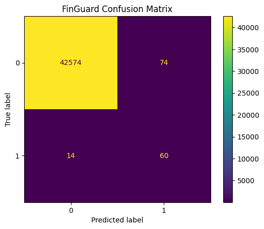
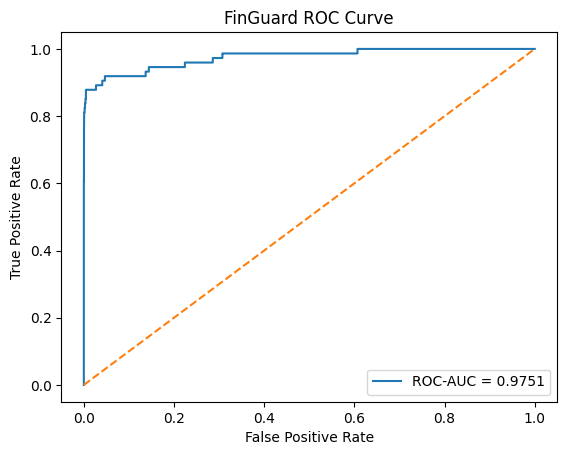
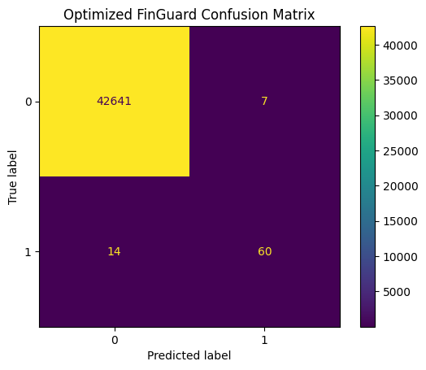
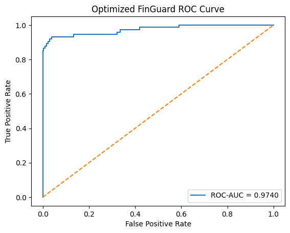

# FinGuard — Financial Fraud Detection

## Overview

**FinGuard** is a supervised machine learning model designed to identify potentially fraudulent financial transactions.

The project uses **XGBoost** for binary classification and focuses on one of the primary challenges in fraud detection: severe class imbalance. Because fraudulent transactions represent only a small fraction of financial activity, model performance cannot be evaluated using accuracy alone.

FinGuard therefore emphasizes fraud detection performance through confusion matrix analysis, precision, recall, F1 score, and ROC-AUC.

The project covers the complete machine learning workflow from data preprocessing and class imbalance handling to model training, optimization, evaluation, and model persistence.

FinGuard is one of the AI models developed to power the financial risk analysis capabilities of the broader **Helios** project.

---

## Problem

Financial fraud detection is a binary classification problem in which a machine learning model attempts to distinguish legitimate transactions from fraudulent activity.

In this implementation:

- `0` represents a legitimate transaction.
- `1` represents a fraudulent transaction.

The primary challenge is that legitimate transactions significantly outnumber fraudulent transactions.

This creates an **imbalanced classification problem**.

A model that predicts nearly every transaction as legitimate could achieve very high accuracy while still failing to identify the transactions that matter most.

For this reason, FinGuard evaluates model performance using several complementary metrics:

- Precision
- Recall
- F1 Score
- ROC-AUC
- Confusion Matrix

The objective is to identify fraudulent transactions while minimizing unnecessary fraud alerts on legitimate transactions.

---

## Dataset

FinGuard uses a financial transaction dataset containing anonymized transaction features and a binary fraud classification target.

The dataset contains a significant imbalance between legitimate and fraudulent observations, reflecting a common challenge in real-world fraud detection.

The machine learning pipeline separates the transaction features from the classification target before preparing the data for training and evaluation.

---

## Data Preparation

Before model training, the dataset passes through a preprocessing pipeline designed to prepare the transaction data while preserving the characteristics of the fraud-detection problem.

The general preparation process includes:

1. Loading and inspecting the transaction dataset.
2. Separating features from the fraud classification target.
3. Creating training and testing datasets.
4. Preserving class proportions through stratification.
5. Scaling the transaction amount feature.
6. Addressing class imbalance in the training data.
7. Preparing the transformed data for model training.

### Stratified Train/Test Split

A stratified train/test split is used to preserve the proportion of legitimate and fraudulent transactions across the training and testing datasets.

This is particularly important for highly imbalanced datasets because a conventional random split could produce subsets with inconsistent minority-class representation.

The test dataset remains separate from the model-training process and is used to evaluate the final classification behavior.

### Feature Scaling

The transaction amount feature is transformed as part of the preprocessing pipeline.

The fitted scaler is persisted separately so that future transactions can receive the same transformation used during model development.

Maintaining the preprocessing component alongside the trained model helps ensure consistency between training and future inference.

---

## Handling Class Imbalance

Fraud detection presents a significant class imbalance because fraudulent transactions represent only a small percentage of the available observations.

To address this issue, FinGuard uses **SMOTE (Synthetic Minority Over-sampling Technique)** on the training data.

SMOTE increases minority-class representation by generating synthetic observations based on existing fraudulent examples.

This provides the classifier with greater exposure to patterns associated with fraudulent transactions during training.

SMOTE is applied to the training data rather than the test data so that model evaluation continues to represent the original distribution of unseen observations.

---

## Model

FinGuard uses **XGBoost (Extreme Gradient Boosting)** as its primary classification algorithm.

XGBoost is an ensemble learning technique that builds decision trees sequentially. Each new tree attempts to correct errors made by previous trees, allowing the model to progressively learn complex relationships within structured transaction data.

The baseline XGBoost model establishes an initial performance benchmark before optimization.

The model is then optimized and evaluated against the baseline to determine how hyperparameter tuning affects fraud-detection behavior.

---

## Machine Learning Workflow

The complete FinGuard machine learning pipeline follows this workflow:

```text
Financial Transaction Data
            │
            ▼
       Data Loading
            │
            ▼
      Data Preparation
            │
            ├── Feature / Target Separation
            ├── Stratified Train/Test Split
            └── Transaction Amount Scaling
            │
            ▼
      Class Balancing
            │
            └── SMOTE
            │
            ▼
      Baseline XGBoost
            │
            ▼
       Model Training
            │
            ▼
      Model Evaluation
            │
            ├── Confusion Matrix
            ├── Precision
            ├── Recall
            ├── F1 Score
            └── ROC-AUC
            │
            ▼
 Hyperparameter Optimization
            │
            └── GridSearchCV
            │
            ▼
     Optimized XGBoost
            │
            ▼
      Final Evaluation
            │
            ▼
      Model Persistence
```

The implementation separates data loading, preprocessing, training, evaluation, and optimization into individual Python modules.

This modular architecture makes the machine learning pipeline easier to maintain, evaluate, and eventually integrate into the broader Helios application.

---

# Model Evaluation

## Baseline FinGuard Model

The baseline model establishes the initial performance benchmark before hyperparameter optimization.

The baseline confusion matrix produced the following results:

| | Predicted Legitimate | Predicted Fraud |
| --- | ---: | ---: |
| **Actual Legitimate** | 42,574 | 74 |
| **Actual Fraud** | 14 | 60 |



The confusion matrix corresponds to:

- **True Negatives (TN): 42,574**
- **False Positives (FP): 74**
- **False Negatives (FN): 14**
- **True Positives (TP): 60**

The baseline model correctly identified **60 fraudulent transactions**.

However, **14 fraudulent transactions were incorrectly classified as legitimate**, representing false negatives.

The model also incorrectly classified **74 legitimate transactions as fraudulent**, representing false positives.

These two types of errors have different implications in a fraud-detection system.

A false negative represents fraudulent activity that was not detected, while a false positive represents a legitimate transaction that was unnecessarily flagged.

### Baseline ROC Analysis

The baseline FinGuard model achieved:

**ROC-AUC: 0.9751**



The Receiver Operating Characteristic curve measures the relationship between the true-positive rate and false-positive rate across different classification thresholds.

The Area Under the Curve summarizes the model's overall ability to distinguish between the two classes.

An ROC-AUC of approximately **0.975** demonstrates strong discrimination between legitimate and fraudulent transactions within the test dataset.

ROC-AUC alone, however, does not describe model behavior at a specific classification threshold.

For this reason, the ROC curve is interpreted alongside the confusion matrix and other classification metrics.

---

# Model Optimization

After establishing the baseline model, FinGuard applies hyperparameter optimization using **GridSearchCV**.

GridSearchCV systematically evaluates combinations of XGBoost hyperparameters to identify a stronger model configuration.

The optimization process explores parameters that influence characteristics such as:

- Number of estimators
- Learning rate
- Tree depth
- Row sampling
- Feature sampling

These parameters affect how the model learns, the complexity of individual trees, and how effectively the ensemble generalizes to unseen observations.

The objective of optimization is not simply to maximize overall accuracy.

Instead, the optimized model is evaluated according to its ability to maintain fraud detection while improving classification behavior on legitimate transactions.

---

# Optimized Model Evaluation

## Optimized Confusion Matrix

The optimized FinGuard model produced the following confusion matrix:

| | Predicted Legitimate | Predicted Fraud |
| --- | ---: | ---: |
| **Actual Legitimate** | 42,641 | 7 |
| **Actual Fraud** | 14 | 60 |



The optimized confusion matrix corresponds to:

- **True Negatives (TN): 42,641**
- **False Positives (FP): 7**
- **False Negatives (FN): 14**
- **True Positives (TP): 60**

The optimized model continued to correctly detect **60 fraudulent transactions**, while **14 fraudulent transactions remained undetected**.

The most significant improvement occurred among legitimate transactions.

The number of legitimate transactions incorrectly classified as fraud decreased from:

**74 → 7**

This represents an approximately **90.5% reduction in false positives**.

Importantly, this reduction occurred without increasing the number of false negatives in the evaluated test set.

### Optimized ROC Analysis

The optimized FinGuard model achieved:

**ROC-AUC: 0.9740**



The optimized ROC-AUC remains very close to the baseline result.

```text
Baseline ROC-AUC:   0.9751
Optimized ROC-AUC:  0.9740
Difference:        -0.0011
```

The small decrease indicates that the model retained approximately the same overall ability to rank fraudulent transactions above legitimate transactions.

However, the confusion matrix reveals an important improvement that ROC-AUC alone does not capture.

At the evaluated classification threshold, the optimized model substantially reduced false-positive classifications while maintaining the same number of true-positive and false-negative fraud classifications.

---

# Baseline vs. Optimized Model

The baseline and optimized models can be directly compared using their test-set results.

| Metric          | Baseline   | Optimized  | Change  |
| --------------- | -----------| ---------- | ------- |
| True Negatives  | 42,574     | **42,641** | +67     |
| False Positives | 74         | **7**      | -67     |
| False Negatives | 14         | **14**     | 0       |
| True Positives  | 60         | **60**     | 0       |
| ROC-AUC         | **0.9751** | 0.9740     | -0.0011 |

## False-Positive Reduction

The most significant change produced by optimization is the reduction in false positives.

```text
Baseline False Positives:     74
Optimized False Positives:     7

Reduction:                    67
Percentage Reduction:       ~90.5%
```

The optimized model therefore generated substantially fewer incorrect fraud alerts for legitimate transactions.

## Fraud Detection

Fraud detection remained unchanged between the two evaluated models:

```text
                     Baseline    Optimized

True Positives           60          60
False Negatives          14          14
```

The optimized model therefore reduced false positives without sacrificing additional fraud detections at the evaluated classification threshold.

---

# Understanding the Optimization Results

The results demonstrate why machine learning optimization should not be evaluated using a single metric.

The baseline model achieved a slightly higher ROC-AUC:

**0.9751 vs. 0.9740**

If ROC-AUC were considered in isolation, the baseline model might appear marginally better.

However, the difference is only **0.0011**, while the optimized model reduced false positives from **74 to 7**.

At the selected threshold, both models still produced:

- 60 true positives
- 14 false negatives

This means the optimized model preserved the same fraud detections in this test set while generating significantly fewer false fraud alerts.

For a financial fraud-detection workflow, this can represent an important operational improvement.

Too many false positives can create unnecessary investigations, increase review workloads, introduce friction for legitimate users, and reduce trust in automated fraud alerts.

At the same time, false negatives remain important because they represent fraudulent transactions that were not identified.

The results therefore illustrate the trade-off between:

**Fraud Detection ↔ False Alerts**

Rather than optimizing solely for one performance metric, the final model should be evaluated according to the operational requirements of the system in which it is deployed.

---

# Model Persistence

After training and optimization, the trained models and preprocessing components are persisted for future use.

Persisting these components allows predictions to be performed without retraining the entire machine learning pipeline.

The model artifacts include:

```text
outputs/
├── amount_scaler.pkl
├── D840_PA_Model_FinGuard.pkl
├── D840_PA_Model_FinGuard_Optimized.pkl
├── finguard_confusion_matrix.png
├── finguard_optimized_confusion_matrix.png
├── finguard_roc_curve.png
└── finguard_optimized_roc_curve.png
```

The preprocessing scaler is stored separately because future transaction data must receive the same transformation that was applied during model development.

This provides the foundation for eventually loading FinGuard inside a backend inference service.

---

# Project Architecture

FinGuard uses a modular Python architecture that separates individual stages of the machine learning lifecycle.

```text
FinGuard/
│
├── data/
│   └── creditcard.csv
│
├── outputs/
│   ├── amount_scaler.pkl
│   ├── D840_PA_Model_FinGuard.pkl
│   ├── D840_PA_Model_FinGuard_Optimized.pkl
│   ├── finguard_confusion_matrix.png
│   ├── finguard_optimized_confusion_matrix.png
│   ├── finguard_roc_curve.png
│   └── finguard_optimized_roc_curve.png
│
├── src/
│   ├── load_data.py
│   ├── preprocess.py
│   ├── train.py
│   ├── evaluate.py
│   └── optimize.py
│
└── README.md
```

### `load_data.py`

Responsible for loading the financial transaction dataset and performing the initial data inspection required by the machine learning pipeline.

### `preprocess.py`

Handles preparation of the dataset before training, including feature and target separation, train/test splitting, scaling, and class imbalance handling.

### `train.py`

Defines and trains the baseline XGBoost fraud-detection model.

The trained baseline model establishes the performance benchmark used during subsequent optimization.

### `evaluate.py`

Evaluates model predictions and generates the performance metrics and visualizations used to analyze classification behavior.

This includes confusion matrix and ROC analysis.

### `optimize.py`

Performs hyperparameter optimization and trains the optimized FinGuard model.

The optimized model is subsequently evaluated against the same test data to compare its behavior with the baseline implementation.

---

# Technologies

### Programming and Data Processing

- Python
- Pandas
- NumPy

### Machine Learning

- Scikit-learn
- XGBoost
- imbalanced-learn
- SMOTE
- GridSearchCV

### Evaluation

- Confusion Matrix
- Precision
- Recall
- F1 Score
- ROC Curve
- ROC-AUC

### Visualization

- Matplotlib

### Model Persistence

- Joblib

---

# Limitations

Although FinGuard demonstrates strong performance on the available test dataset, several limitations must be considered before interpreting these results as production-level performance.

### Historical Data

The model learns patterns contained within the available historical transaction dataset.

Fraud strategies can evolve over time, meaning patterns learned from historical observations may not fully represent future fraudulent behavior.

### Dataset Generalization

Strong performance on the current dataset does not guarantee equivalent performance across different financial institutions, transaction environments, geographic regions, or future transaction streams.

Independent validation using additional datasets would provide stronger evidence of model generalization.

### Classification Threshold

The confusion matrices represent model behavior at a particular classification threshold.

Changing this threshold can alter the balance between fraud recall and false-positive classifications.

A production system would therefore need to select its operating threshold according to the relative business cost of false negatives and false positives.

### False Negatives

The optimized model still failed to identify **14 fraudulent transactions** in the evaluated test set.

Although optimization substantially reduced false positives, further work could investigate whether fraud recall can be improved without creating an unacceptable increase in false alerts.

### Production Validation

FinGuard is an experimental machine learning implementation and has not been validated for autonomous use in a production financial environment.

A production implementation would require additional validation, monitoring, security controls, data governance, and human oversight.

---

# Responsible AI Considerations

Fraud detection can affect legitimate financial activity, making responsible model evaluation important.

A false-positive prediction could incorrectly identify legitimate behavior as suspicious, while a false-negative prediction could allow fraudulent activity to remain undetected.

For this reason, FinGuard should be treated as a **decision-support component rather than an unquestionable source of truth**.

A real-world implementation should consider:

- Human review of high-risk predictions
- Model monitoring
- False-positive and false-negative costs
- Dataset drift
- Model retraining
- Security of financial information
- Auditability of fraud alerts
- Appropriate decision thresholds

These considerations become particularly important as the model moves from experimentation toward application integration.

---

# Relationship to Helios

FinGuard is one of the artificial intelligence models being developed for **Helios**, a broader full-stack financial technology project.

Within the Helios ecosystem, FinGuard is intended to provide the **fraud-detection capability** of the platform.

The FinGuard project focuses specifically on the machine learning lifecycle:

```text
Data
  ↓
Preprocessing
  ↓
Training
  ↓
Evaluation
  ↓
Optimization
  ↓
Model Artifact
```

The broader Helios project focuses on integrating these AI capabilities into a complete application architecture.

The **Helios frontend is currently under development**, with the goal of providing a user-facing web application capable of interacting with the financial intelligence components developed for the platform.

Keeping FinGuard separate from the application code allows the model to be independently developed, tested, optimized, and versioned before being exposed through the Helios backend and frontend.

FinGuard works alongside **FinSage**, another model within the Helios AI ecosystem focused on financial risk assessment.

➡️ **[View Helios](https://github.com/DonnaIsabel97/helios_ai)**

➡️ **[View Helios AI Models](../README.md)**

---

# Key Takeaways

FinGuard demonstrates the development and optimization of an end-to-end machine learning workflow for an imbalanced financial classification problem.

The project demonstrates:

- Financial fraud detection using supervised machine learning.
- Development of a modular Python machine learning pipeline.
- Data preparation for structured financial datasets.
- Stratified train/test splitting for imbalanced data.
- Feature scaling and preprocessing persistence.
- Handling minority-class representation using SMOTE.
- Training an XGBoost classifier.
- Evaluating imbalanced classification beyond overall accuracy.
- Using precision, recall, F1, confusion matrices, and ROC-AUC.
- Applying GridSearchCV for systematic hyperparameter optimization.
- Comparing baseline and optimized classification behavior.
- Reducing false positives from **74 to 7** while maintaining the same fraud detections in the evaluated test set.
- Understanding the distinction between threshold-dependent and threshold-independent evaluation.
- Persisting trained models and preprocessing components for future inference.
- Considering model limitations and responsible AI requirements.
- Preparing an independently developed machine learning component for integration into a larger full-stack AI application.

---

## Project Context

FinGuard was originally developed through graduate-level work in advanced artificial intelligence and machine learning and is now part of the AI model development supporting **Helios**.

The project demonstrates the application of supervised machine learning to a highly imbalanced financial risk problem while emphasizing model evaluation, optimization, and the practical trade-offs involved in fraud detection.

Together with **FinSage**, FinGuard forms part of the AI/ML layer being developed to provide intelligent financial risk-analysis capabilities within the broader Helios platform.