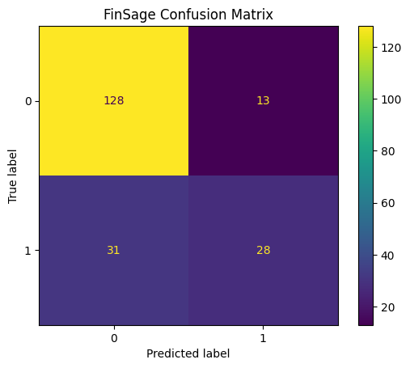
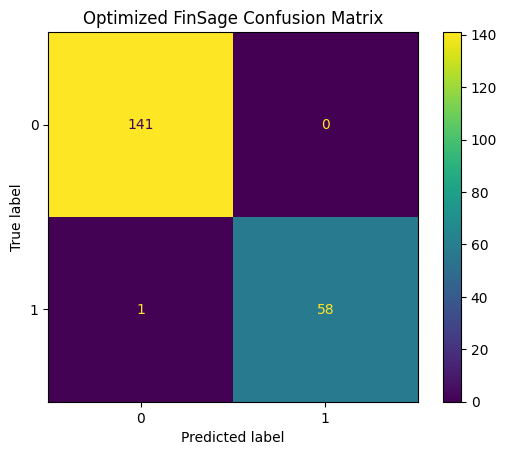

# FinSage — Financial Risk Classification

## Overview

**FinSage** is a probabilistic machine learning model designed to classify financial credit risk using a **Bayesian Network**.

The project focuses on modeling relationships between financial and credit-related variables while maintaining an interpretable probabilistic structure. Rather than treating prediction as an isolated output, FinSage represents dependencies between relevant variables and uses probabilistic inference to estimate classification outcomes.

The project covers the complete machine learning workflow, including data preparation, feature selection, target transformation, discretization, Bayesian Network construction, probabilistic inference, model evaluation, optimization, and model persistence.

FinSage is one of the AI models developed to power the financial risk analysis capabilities of the broader **Helios** project.

---

## Problem

Financial risk assessment involves evaluating available financial information to determine whether an observation belongs to a lower-risk or higher-risk category.

FinSage approaches this as a binary classification problem.

In this implementation:

- `0` represents the lower-risk class.
- `1` represents the higher-risk class.

Unlike conventional classifiers that primarily learn a direct mapping between input features and a target variable, FinSage uses a **Bayesian Network** to represent probabilistic dependencies among financial variables.

The objective is therefore not only to produce classifications but also to explore how probabilistic modeling can support interpretable financial risk assessment.

---

## Dataset

FinSage uses a structured credit dataset containing numerical financial and credit-related variables.

The dataset provides information representing characteristics relevant to credit-risk assessment.

Before model construction, the dataset is prepared through a pipeline that selects relevant variables, transforms the classification target, and prepares continuous variables for probabilistic modeling.

The processed observations are subsequently used to construct and evaluate the Bayesian Network.

---

## Data Preparation

The FinSage pipeline begins by loading and inspecting the credit dataset.

The preparation process includes:

1. Loading the financial dataset.
2. Inspecting the available features.
3. Selecting variables relevant to risk classification.
4. Separating predictive variables from the classification target.
5. Transforming the target into the required binary representation.
6. Preparing continuous variables for Bayesian modeling.
7. Creating training and testing datasets.
8. Preparing the transformed observations for Bayesian Network training.

These transformations provide the structured representation required by the probabilistic model.

---

## Feature Selection

Feature selection is an important component of FinSage because the structure of a Bayesian Network represents dependencies between the variables included in the model.

Rather than automatically incorporating every available feature, the implementation selects variables considered relevant to the financial risk-classification problem.

This reduces unnecessary complexity and makes the resulting probabilistic relationships easier to interpret.

The selected variables form the nodes used within the Bayesian Network.

---

## Discretization

Bayesian Network implementations frequently operate on discrete variable states.

Because the original financial dataset contains numerical variables, continuous features are transformed into discrete intervals before model training.

Conceptually, the transformation follows:

```text
Continuous Financial Variable
            │
            ▼
      Determine Ranges
            │
            ▼
      Create Intervals
            │
            ▼
       Discrete States
```

Discretization allows continuous financial observations to be represented as categorical states that can be modeled through conditional probability relationships.

The same transformation logic must be maintained when the trained model is later used for inference.

---

## Bayesian Network

FinSage uses a **Bayesian Network** as its primary machine learning model.

A Bayesian Network is a probabilistic graphical model in which:

- Nodes represent variables.
- Directed edges represent conditional dependencies.
- Conditional probability distributions describe relationships between connected variables.

The general structure can be represented as:

```text
Financial Variables
        │
        ▼
Probabilistic Dependencies
        │
        ▼
Conditional Probability
      Distributions
        │
        ▼
 Probabilistic Inference
        │
        ▼
 Financial Risk Class
```

This differs from many conventional classification algorithms because the model explicitly represents relationships among variables through a probabilistic graph.

---

## Expert-Designed Structure

FinSage uses an **expert-designed Bayesian Network structure** rather than relying exclusively on automatic structure learning.

This design approach allows the model architecture to be constructed around meaningful relationships between the selected variables.

For a relatively limited dataset, an expert-designed structure also provides a more controlled approach than attempting to infer a potentially unstable network structure entirely from the available observations.

Automatic structure learning could be explored with substantially larger datasets in future iterations to determine whether additional relationships can be discovered while reducing dependence on manually defined assumptions.

---

## Probabilistic Inference

Once the Bayesian Network has been trained, FinSage performs probabilistic inference to estimate the target classification.

Instead of directly producing a class through a conventional decision boundary, the model evaluates the probability associated with the possible target states.

Conceptually:

```text
Observed Financial Features
            │
            ▼
     Bayesian Network
            │
            ▼
   Probabilistic Inference
            │
            ▼
 P(Lower Risk) / P(Higher Risk)
            │
            ▼
      Predicted Class
```

The predicted class is derived from the probabilistic output produced by the network.

This approach provides an interpretable foundation for financial risk classification.

---

## Machine Learning Workflow

The complete FinSage pipeline follows this workflow:

```text
Financial Credit Data
          │
          ▼
     Data Loading
          │
          ▼
    Feature Selection
          │
          ▼
  Target Transformation
          │
          ▼
      Discretization
          │
          ▼
   Train / Test Split
          │
          ▼
Expert-Designed Bayesian
    Network Structure
          │
          ▼
 Parameter Estimation
          │
          ▼
 Probabilistic Inference
          │
          ▼
    Model Evaluation
          │
          ▼
   Model Optimization
          │
          ▼
 Optimized Evaluation
          │
          ▼
    Model Persistence
```

The implementation separates data loading, preprocessing, training, evaluation, and optimization into individual Python modules.

This modular architecture makes the probabilistic machine learning pipeline easier to maintain, evaluate, and eventually integrate into the broader Helios application.

---

# Model Evaluation

## Baseline FinSage Model

The baseline Bayesian Network establishes the initial performance benchmark before optimization.

The baseline confusion matrix produced the following results:

| | Predicted Lower Risk | Predicted Higher Risk |
| --- | ---: | ---: |
| **Actual Lower Risk** | 128 | 13 |
| **Actual Higher Risk** | 31 | 28 |



The confusion matrix corresponds to:

- **True Negatives (TN): 128**
- **False Positives (FP): 13**
- **False Negatives (FN): 31**
- **True Positives (TP): 28**

The baseline model correctly classified **128 lower-risk observations** and **28 higher-risk observations**.

However, **31 higher-risk observations were incorrectly classified as lower risk**.

The model also classified **13 lower-risk observations as higher risk**.

Across the 200 evaluated observations, the baseline model therefore produced:

```text
Correct Predictions:     156
Incorrect Predictions:    44
Accuracy:                78.0%
```

The baseline results establish a useful reference point for evaluating subsequent optimization.

---

# Model Optimization

After establishing the baseline Bayesian Network, FinSage applies optimization to improve its classification behavior.

The optimization process focuses on improving the probabilistic model and the way the available financial information is represented within the Bayesian Network.

Because FinSage is based on probabilistic graphical modeling, optimization differs from conventional hyperparameter tuning performed on models such as XGBoost.

The objective is to improve the model's ability to distinguish between the two financial risk classes while preserving the probabilistic and interpretable nature of the model.

The optimized model is subsequently evaluated using the same classification framework as the baseline implementation.

---

# Optimized Model Evaluation

The optimized FinSage model produced the following confusion matrix:

| | Predicted Lower Risk | Predicted Higher Risk |
| --- | ---: | ---: |
| **Actual Lower Risk** | 141 | 0 |
| **Actual Higher Risk** | 1 | 58 |



The optimized confusion matrix corresponds to:

- **True Negatives (TN): 141**
- **False Positives (FP): 0**
- **False Negatives (FN): 1**
- **True Positives (TP): 58**

The optimized model correctly classified **141 lower-risk observations** and **58 higher-risk observations**.

Only **one higher-risk observation was incorrectly classified as lower risk**, while no lower-risk observations were incorrectly classified as higher risk.

Across the 200 evaluated observations:

```text
Correct Predictions:     199
Incorrect Predictions:     1
Accuracy:                99.5%
```

The optimized model therefore produced a substantial improvement over the baseline implementation on the evaluated test set.

---

# Baseline vs. Optimized Model

The effect of optimization can be seen directly by comparing the two confusion matrices.

| Metric                | Baseline | Optimized | Change                  |
| --------------------- | -------- | --------- | ----------------------- |
| True Negatives        | 128      | **141**   | +13                     |
| False Positives       | 13       | **0**     | -13                     |
| False Negatives       | 31       | **1**     | -30                     |
| True Positives        | 28       | **58**    | +30                     |
| Correct Predictions   | 156      | **199**   | +43                     |
| Incorrect Predictions | 44       | **1**     | -43                     |
| Accuracy              | 78.0%    | **99.5%** | +21.5 percentage points |

The optimized model improved classification behavior for both classes.

## Higher-Risk Detection

One of the most important changes occurred in the detection of higher-risk observations.

```text
                         Baseline     Optimized

True Positives               28           58
False Negatives              31            1
```

The baseline model correctly identified only 28 of the 59 higher-risk observations.

The optimized model correctly identified 58 of the same 59 higher-risk observations.

Higher-risk recall therefore increased from approximately:

```text
Baseline Recall:     47.5%
Optimized Recall:    98.3%
```

This represents a substantial improvement in the model's ability to identify observations belonging to the higher-risk class.

## False Positives

False-positive classifications were also eliminated in the optimized evaluation:

```text
Baseline False Positives:     13
Optimized False Positives:     0
```

This means all **141 lower-risk observations** in the evaluated test set were correctly classified by the optimized model.

## Overall Classification

The total number of classification errors decreased from:

**44 → 1**

This corresponds to an approximately **97.7% reduction in classification errors** on the evaluated test set.

---

# Understanding the Optimization Results

The difference between the baseline and optimized FinSage models is substantial.

The baseline model correctly classified 78% of the evaluated observations but struggled particularly with the higher-risk class.

Of the 59 higher-risk observations:

```text
Baseline:
28 correctly classified
31 incorrectly classified

Optimized:
58 correctly classified
1 incorrectly classified
```

The optimized implementation therefore demonstrates significantly stronger separation between the two classes within this evaluation.

However, extremely strong test-set performance should be interpreted carefully.

A result of **199 correct predictions out of 200 observations** demonstrates strong performance on the current test set, but it does not by itself establish that the model will achieve the same performance on new financial datasets.

Independent validation remains important before considering the model suitable for real-world financial decision-making.

---

# Model Persistence

After training and optimization, the FinSage models are persisted so that they can later be loaded without reconstructing and retraining the Bayesian Network.

The model artifacts include:

```text
outputs/
├── D804_PA_Model_FinSage.pkl
├── D804_PA_Model_FinSage_Optimized.pkl
├── finsage_confusion_matrix.png
└── finsage_optimized_confusion_matrix.png
```

Persisting the trained model provides the foundation for eventually exposing FinSage through an inference service within the Helios architecture.

---

# Project Architecture

FinSage uses a modular Python architecture separating the major stages of the machine learning lifecycle.

```text
FinSage/
│
├── data/
│   └── german_credit_numeric.csv
│
├── outputs/
│   ├── D804_PA_Model_FinSage.pkl
│   ├── D804_PA_Model_FinSage_Optimized.pkl
│   ├── finsage_confusion_matrix.png
│   └── finsage_optimized_confusion_matrix.png
│
├── src/
│   ├── load_data.py
│   ├── preprocess.py
│   ├── train.py
│   ├── evaluate.py
│   └── optimize.py
│
└── README.md
```

### `load_data.py`

Responsible for loading the credit dataset and performing the initial inspection required by the machine learning pipeline.

### `preprocess.py`

Handles preparation of the dataset, including feature selection, target transformation, and the transformations required before Bayesian Network training.

### `train.py`

Defines the Bayesian Network structure and trains the baseline FinSage model.

This stage establishes the probabilistic relationships used to perform financial risk classification.

### `evaluate.py`

Performs probabilistic inference on the evaluation data and compares the predicted classifications with the actual target values.

The resulting predictions are used to generate the confusion matrix and evaluate classification behavior.

### `optimize.py`

Implements the optimized FinSage configuration and produces the optimized model used for comparison with the baseline implementation.

---

# Technologies

### Programming and Data Processing

- Python
- Pandas
- NumPy

### Machine Learning

- Bayesian Networks
- Probabilistic Graphical Models
- Scikit-learn

### Data Preparation

- Feature Selection
- Target Transformation
- Discretization
- Train/Test Splitting

### Evaluation

- Confusion Matrix
- Accuracy
- Precision
- Recall
- F1 Score

### Visualization

- Matplotlib

### Model Persistence

- Joblib / Pickle

---

# Limitations

Although the optimized FinSage model demonstrates strong classification performance on the evaluated dataset, several limitations should be considered.

### Dataset Size

The available dataset is relatively small compared with datasets typically used to validate production financial risk models.

This is particularly relevant when interpreting the optimized model's 99.5% test accuracy.

Additional validation using larger independent datasets would provide stronger evidence that the observed performance generalizes beyond the current dataset.

### Expert-Designed Structure

The Bayesian Network uses an expert-designed structure rather than automatically learning the complete graph structure from the data.

This provides greater control and interpretability but introduces assumptions about the relationships among variables.

With substantially larger datasets, automatic or hybrid structure-learning approaches could be investigated.

### Discretization

Continuous financial variables are transformed into discrete states.

While this makes Bayesian Network modeling possible and improves interpretability, discretization can reduce the granularity of the original numerical information.

Different discretization strategies may therefore affect model behavior.

### Generalization

Strong performance on the current test set does not guarantee equivalent performance across different populations, financial institutions, geographic regions, or lending environments.

External validation would be required before real-world deployment.

### Financial Decision-Making

FinSage is an experimental machine learning model and has not been validated for autonomous financial decision-making.

A production implementation would require significantly broader validation, monitoring, governance, security controls, and human oversight.

---

# Responsible AI Considerations

Financial risk classification can influence decisions that have meaningful consequences for individuals.

This makes responsible model development particularly important.

FinSage should therefore be treated as a **decision-support model rather than an autonomous financial decision-maker**.

Important considerations include:

- Fairness across demographic groups
- Potential bias in historical financial data
- Transparency of model assumptions
- Interpretability of probabilistic relationships
- Monitoring for model and data drift
- Human review of consequential decisions
- Protection of sensitive financial information
- Validation across different populations
- Appropriate governance of model outputs

The use of a Bayesian Network provides an interpretable probabilistic structure, but interpretability alone does not guarantee fairness or eliminate bias.

Model performance should therefore be evaluated alongside the social and operational consequences of using its predictions.

---

# Relationship to Helios

FinSage is one of the artificial intelligence models being developed for **Helios**, a broader full-stack financial technology project.

Within the Helios ecosystem, FinSage is intended to provide a **financial risk-assessment capability** through probabilistic machine learning.

The FinSage project focuses specifically on the machine learning lifecycle:

```text
Financial Data
      ↓
Preprocessing
      ↓
Feature Transformation
      ↓
Bayesian Modeling
      ↓
Probabilistic Inference
      ↓
Evaluation
      ↓
Optimization
      ↓
Model Artifact
```

The broader Helios project focuses on integrating these capabilities into a complete application architecture.

The **Helios frontend is currently under development**, with the goal of providing a web application capable of interacting with the financial intelligence components developed for the platform.

Keeping FinSage as an independent model project allows the probabilistic model to be developed, evaluated, optimized, and versioned independently before application integration.

FinSage works alongside **FinGuard**, the fraud-detection model within the Helios AI ecosystem.

Together, the two models address different dimensions of financial intelligence:

```text
                    HELIOS
                       │
              ┌────────┴────────┐
              │                 │
           FinGuard           FinSage
              │                 │
      Fraud Detection     Risk Assessment
              │                 │
          XGBoost       Bayesian Network
              │                 │
              └────────┬────────┘
                       │
                 Helios Platform
```

➡️ **[View Helios](https://github.com/DonnaIsabel97/helios_ai)**

➡️ **[View Helios AI Models](../README.md)**

---

# Key Takeaways

FinSage demonstrates the development and optimization of an interpretable probabilistic machine learning system for financial risk classification.

The project demonstrates:

- Financial risk classification using probabilistic machine learning.
- Development of a Bayesian Network for structured financial data.
- Feature selection for probabilistic graphical modeling.
- Transformation of numerical variables through discretization.
- Design of an expert-defined Bayesian Network structure.
- Parameter estimation from financial observations.
- Classification through probabilistic inference.
- Modular separation of data loading, preprocessing, training, evaluation, and optimization.
- Comparison between baseline and optimized model behavior.
- Improvement from **78.0% to 99.5% accuracy** on the evaluated test set.
- Reduction of false negatives from **31 to 1**.
- Elimination of false positives from **13 to 0**.
- Increase in higher-risk recall from approximately **47.5% to 98.3%**.
- Reduction of total classification errors from **44 to 1**.
- Persistence of trained probabilistic models for future inference.
- Recognition of the limitations associated with unusually strong test-set performance.
- Consideration of fairness, interpretability, and responsible AI in financial modeling.
- Preparation of an independently developed AI model for integration into a broader full-stack financial platform.

---

## Project Context

FinSage was originally developed through graduate-level work in advanced artificial intelligence and machine learning and is now part of the AI model development supporting **Helios**.

The project demonstrates the use of Bayesian Networks and probabilistic inference for financial risk classification while emphasizing interpretability, model evaluation, optimization, and responsible AI considerations.

Together with **FinGuard**, FinSage forms part of the AI/ML layer being developed to provide intelligent financial analysis capabilities within the broader Helios platform.