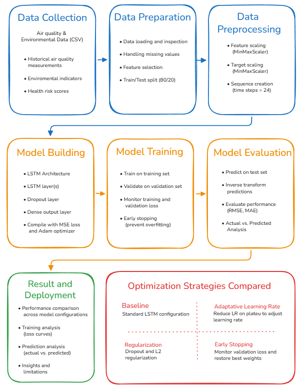
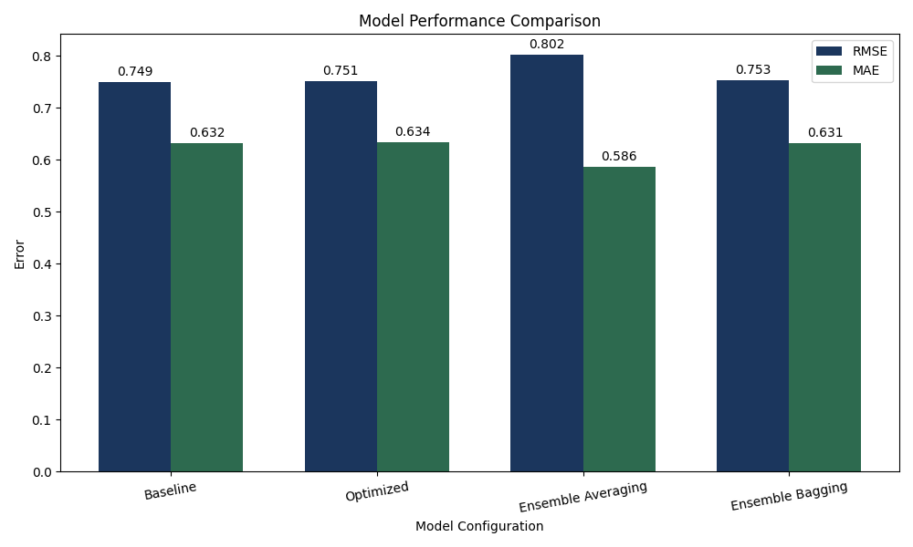
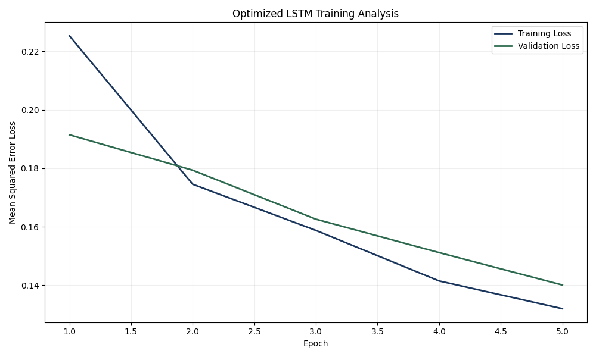
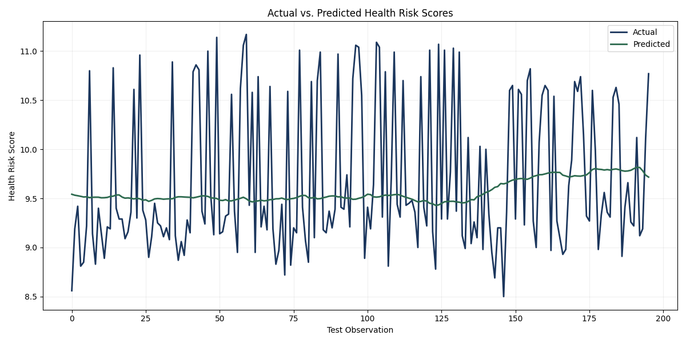
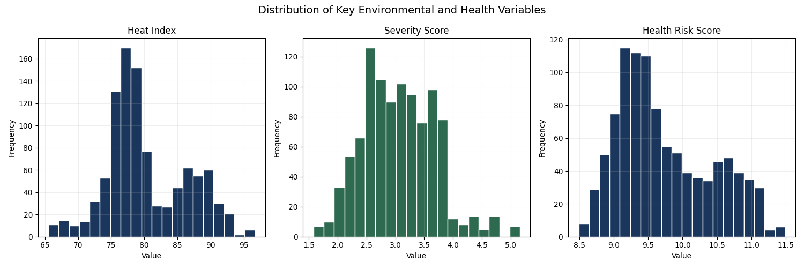
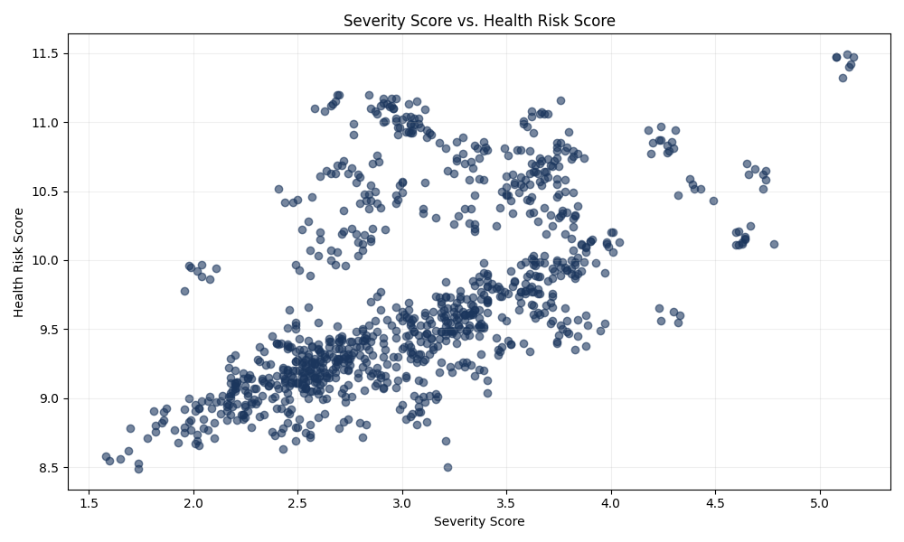

# LSTM Time-Series Forecasting & Model Optimization

## Overview

This project explores the application of **Long Short-Term Memory (LSTM) neural networks** to a multivariate time-series forecasting problem involving environmental data.

The project covered the machine learning lifecycle from data preparation and model development through optimization, evaluation, and interpretation. Particular attention was given to understanding how different training, optimization, and regularization techniques influence model performance and generalization.

This portfolio version focuses on the **methodology, machine learning concepts, results, and knowledge gained from the project**.

---

## Objectives

The primary objectives of the project were to:

* Analyze a multivariate time-series forecasting problem.
* Evaluate potential machine learning approaches.
* Develop an LSTM-based forecasting model.
* Prepare sequential data for deep learning.
* Establish and evaluate baseline model performance.
* Explore model optimization and regularization techniques.
* Experiment with ensemble-learning approaches.
* Compare model performance using appropriate regression metrics.
* Analyze model behavior and interpret results.
* Explore the adaptability of the AI approach to other forecasting domains.

---

## Approach

### Model Selection

Multiple machine learning approaches were considered for the forecasting problem.

An **LSTM neural network** was selected because it is designed to process sequential data and learn temporal dependencies across observations.

The project provided practical experience in considering not only whether a model can solve a problem, but **why a particular model is appropriate for the characteristics of the available data**.

### Data Preparation

The project worked with multivariate environmental and temporal data containing information related to factors such as:

* Temperature
* Air-quality measurements
* Humidity
* Precipitation
* Wind conditions
* Atmospheric conditions
* Solar conditions
* Environmental severity indicators
* Temporal information

The data was prepared through feature selection, missing-value handling, and feature scaling before being transformed into sequential observations suitable for LSTM training.

### Time-Series Modeling

Historical observations were organized into sequences so the LSTM could learn temporal relationships between environmental conditions and the prediction target.

This process strengthened my understanding of how traditional tabular data preparation differs from preparing data for **sequence-based neural networks**.

---

## 🏗️ Conceptual Workflow

The overall machine learning process followed the general workflow shown below:

The workflow covers the major stages of:

**Time-Series Data → Data Preparation → LSTM Modeling → Optimization → Evaluation**

The public diagram intentionally represents the project at a conceptual level rather than reproducing the original implementation architecture.

---

## Model Optimization

After establishing a baseline model, I explored several techniques intended to improve training behavior and model generalization.

These included concepts related to:

* L2 regularization
* Dropout regularization
* Early stopping
* Adaptive learning rates

The project provided an opportunity to compare model behavior before and after optimization rather than evaluating a single model configuration in isolation.

---

## Ensemble Learning

The project also explored **ensemble-learning techniques** involving multiple trained models.

The ensemble experiments include:

* Model averaging
* Bagging

This allowed me to investigate whether combining predictions from multiple models could improve the stability or predictive performance of the forecasting system.

---

## Model Evaluation

Because this project involved predicting a continuous value, model performance was evaluated using regression metrics.

### Root Mean Squared Error (RMSE)

RMSE was used to measure prediction error while giving greater weight to larger errors.

### Mean Absolute Error (MAE)

MAE was used to measure the average absolute difference between predicted and observed values.

These metrics were used to compare different stages and configurations of the model-development process.

### Performance Comparison

The experiments produced mixed results across the evaluated configurations. The baseline model achieved the lowest RMSE, while ensemble averaging achieved the lowest MAE. This highlights the trade-off between average prediction error and sensitivity to larger individual errors.

*Comparison of model performance across the approaches explored during the project.*

---

## Training Analysis

Training and validation loss were monitored throughout the optimization process to evaluate model convergence and generalization behavior.

Across the five-epoch training run, both training and validation loss decreased consistently. Training loss decreased from approximately 0.225 to 0.132, while validation loss decreased from approximately 0.191 to 0.140.

The validation curve followed a similar downward trend to the training curve, with no clear divergence between them during the observed epochs. This suggests that the model continued learning without showing obvious signs of overfitting within the observed training window.

The run was limited to five epochs due to computational and time constraints. Because both loss curves were still decreasing at the final epoch, additional training could be explored to determine whether the model would continue improving or eventually converge.

---

## Prediction Analysis

Predicted values from the optimized LSTM were compared with the observed values in the test dataset to visually evaluate forecasting behavior.

The optimized model captured the general level and gradual trend of the target variable but produced considerably smoother predictions than the observed values. While the actual health-risk scores exhibited frequent short-term peaks and drops, the predicted values remained within a narrower range.

This behavior indicates that the model was more successful at learning the overall tendency of the target than reproducing its short-term variability and extreme values. The difference between the observed and predicted series also helps explain the remaining prediction error measured by RMSE and MAE.

Further experimentation could investigate whether additional training, model configuration, feature engineering, sequence design, or regularization adjustments improve the model's ability to capture short-term variations.

---

## Exploratory Data Analysis

Exploratory data analysis was performed to better understand the distribution of key variables and their relationships with the prediction target before model evaluation.

### Feature Distributions

The distributions of `heatIndex`, `severityScore`, and `healthRiskScore` were examined to understand their ranges, variability, and concentration of values.

The analysis showed that the variables exhibit different distributions and levels of variability. Understanding these differences provided additional context for interpreting the dataset and the behavior of the forecasting model.

### Severity and Health Risk Relationship

The relationship between `severityScore` and the target variable, `healthRiskScore`, was also examined.

The scatter plot shows an overall positive relationship between environmental severity and health-risk scores. However, observations with similar severity scores can exhibit noticeably different health-risk values, indicating that severity alone does not fully explain the target variable.

This analysis supports the use of multiple environmental and temporal features when modeling health risk rather than relying on a single predictor.

## Model Adaptability

An additional component of the project explored how the general forecasting approach could be adapted to another application domain.

This involved considering how changes in:

* Input features
* Data characteristics
* Domain-specific variables
* Preprocessing
* Training data
* Model interpretation

would be required when transferring an AI approach to a different forecasting problem.

This exercise emphasized that successfully adapting a machine learning solution requires more than simply reusing an existing model.

---

## Technologies

### Languages & Libraries

* Python
* TensorFlow / Keras
* Scikit-learn
* Pandas
* NumPy
* Matplolib

### AI & Machine Learning

* Deep Learning
* Long Short-Term Memory (LSTM)
* Time-Series Forecasting
* Regression
* Sequential Data Processing
* Feature Scaling
* Model Optimization
* Regularization
* Ensemble Learning
* Model Evaluation

---

## Key Takeaways

This project strengthened my understanding of how to approach a machine learning problem as a complete process rather than focusing exclusively on model implementation.

Key areas of development included:

* Selecting models based on the characteristics of the problem and data.
* Preparing multivariate sequential data for deep learning.
* Developing and training LSTM models.
* Establishing baseline performance before optimization.
* Applying techniques intended to improve model generalization.
* Understanding the role of regularization in neural networks.
* Experimenting with ensemble-learning approaches.
* Evaluating regression models using RMSE and MAE.
* Analyzing training behavior and prediction performance.
* Interpreting results in the context of the original problem.
* Considering how an AI approach can be adapted to a different domain.

---

## Repository Structure

The public repository focuses on high-level methodology, concepts, visualizations, and results from the project.

> **Project Context:** Graduate coursework project adapted for portfolio presentation.